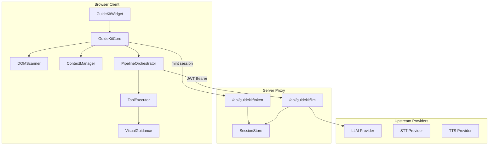
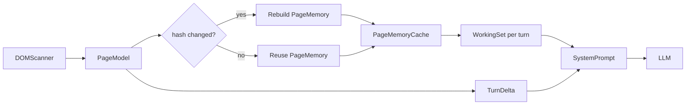
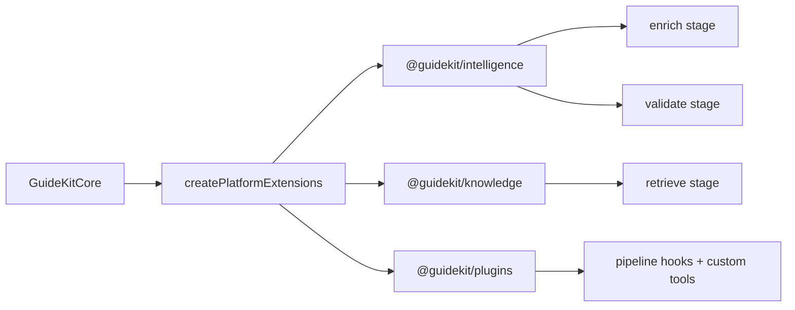

# GuideKit Architecture Vision

> **Ultimate goal:** Once integrated, GuideKit becomes a reliable AI assistant embedded in any website — explaining what the user sees, highlighting the right UI, guiding them through flows, and answering questions grounded in the live page, not guesses.

This document is the end-to-end architecture reference for building toward that goal. It synthesizes the current SDK state, target design, reliability model, and phased roadmap.

---

## Table of Contents

1. [The Ultimate Goal](#1-the-ultimate-goal)
2. [Product Promise](#2-product-promise)
3. [What Makes GuideKit Different](#3-what-makes-guidekit-different)
4. [System Architecture](#4-system-architecture)
5. [End-to-End Data Flow](#5-end-to-end-data-flow)
6. [Context Capture Strategy](#6-context-capture-strategy)
7. [LLM Orchestration and Agent Tools](#7-llm-orchestration-and-agent-tools)
8. [Reliability and Accuracy Model](#8-reliability-and-accuracy-model)
9. [Token Cost and Performance](#9-token-cost-and-performance)
10. [Security Boundary](#10-security-boundary)
11. [Extension Architecture](#11-extension-architecture)
12. [Agent Team and Ownership](#12-agent-team-and-ownership)
13. [Phased Roadmap](#13-phased-roadmap)
14. [Success Metrics](#14-success-metrics)
15. [Testing Strategy](#15-testing-strategy)
16. [Key Files Reference](#16-key-files-reference)

---

## 1. The Ultimate Goal

GuideKit is a **multi-package AI guidance SDK** for web applications. The north star is simple:

> **Drop GuideKit into any website. The agent understands what is on screen, helps the user navigate and complete tasks, and never invents UI that does not exist.**

### What the agent must do

| Capability | Description |
|------------|-------------|
| **Explain** | Describe page sections, features, and content in plain language |
| **Show** | Scroll to relevant areas, start guided tours, surface visible context |
| **Highlight** | Spotlight specific elements with tooltips so users know exactly where to look |
| **Answer** | Respond to free-form questions grounded in the current page state |
| **Act (safely)** | Click, navigate, and execute developer-registered actions within guardrails |
| **Persist** | Maintain conversation memory across turns and page navigations within a session |

### What the agent is not

- Not a generic chat widget that guesses from a URL
- Not a crawler that ingests an entire multi-page site at once
- Not a replacement for product documentation (though it can augment it via RAG)
- Not omniscient inside cross-origin iframes, canvas apps, or inaccessible DOM

The agent's knowledge boundary is **what the browser can see and what the developer exposes** — that is the correct and reliable model.

---

## 2. Product Promise

When a developer integrates GuideKit (React/Next.js primary; vanilla IIFE secondary), their users get:

1. **Instant page awareness** — the SDK scans the rendered DOM and builds a structured `PageModel` within budget (~5KB compact representation).
2. **Visual guidance** — spotlight overlays, tooltips, scroll, and tours that point at real elements.
3. **Grounded answers** — every LLM turn includes page context; tools verify and expand context on demand.
4. **Secure by default** — API keys stay on the server; the browser holds only session tokens.
5. **Observable behavior** — pipeline telemetry, validation events, and E2E coverage make reliability measurable.

### Primary integration surface (v1)

- **React/Next.js** — `<GuideKitProvider>` + `/api/guidekit/*` proxy routes
- **Vanilla embed** — IIFE bundle for script-tag integration on any site

---

## 3. What Makes GuideKit Different

| Generic chat widget | GuideKit |
|---------------------|----------|
| Text-only responses | Visual guidance (highlight, tour, scroll) |
| Static or manual context | Live DOM intelligence with mutation-aware rescans |
| API keys in browser (risky) | Proxy mode: JWT session tokens, keys on server |
| One-shot prompts | Multi-round tool loop (read → highlight → navigate) |
| No grounding validation | Hallucination guard validates claims against `PageModel` |
| Monolithic bundle | Composable packages: core, react, server, optional extensions |

GuideKit is an **SDK-first guidance engine**, not a copy-paste chat component. Extensions (`intelligence`, `knowledge`, `plugins`) plug in via dynamic imports without bloating the core facade.

---

## 4. System Architecture

```
guidekit/
├── packages/
│   ├── core/           # Engine: DOM, context, pipeline, LLM, tools, voice
│   ├── react/          # Provider, hooks, Shadow DOM widget
│   ├── server/         # Token auth, session store, LLM/voice proxy
│   ├── intelligence/   # Semantic page analysis, hallucination guard
│   ├── knowledge/      # BM25/TF-IDF client-side RAG
│   ├── plugins/        # Plugin registry and pipeline hooks
│   ├── vanilla/        # IIFE script-tag bundle
│   └── cli/            # init, doctor, generate-secret
├── apps/
│   ├── example-nextjs/ # Reference Next.js integration (proxy mode)
│   └── docs/           # Public documentation (Nextra)
└── e2e/                # Contract (CI) + Live (publish gate) Playwright tests
```

### Layer responsibilities



| Package | Owns |
|---------|------|
| `@guidekit/core` | DOM scan, `PageModel`, context assembly, LLM loop, built-in tools, voice primitives, pipeline |
| `@guidekit/react` | Provider, hooks, Shadow DOM widget — no duplicated business logic |
| `@guidekit/server` | Session store, JWT auth, rate limit, Next.js adapter, LLM/STT/TTS proxy |
| `@guidekit/intelligence` | Semantic enrichment, hallucination guard |
| `@guidekit/knowledge` | Document retrieval (BM25/TF-IDF) |
| `@guidekit/plugins` | Custom tools, context providers, pipeline hooks |

### Design rules (non-negotiable)

1. **Core facade stays thin** — `packages/core/src/core.ts` is a facade (~400 LOC target); subsystems live in `packages/core/src/core/`.
2. **No hard deps on Tier B packages** — `intelligence`, `knowledge`, `plugins` load via dynamic import in `pipeline/extensions.ts`.
3. **Proxy by default** — never expose LLM API keys in the browser.
4. **Measure everything** — telemetry spans and token budgets are first-class.

---

## 5. End-to-End Data Flow

Every user message traverses the v2 pipeline:

```
scan → enrich → retrieve → context → cognize → llm → validate → render
```

### Stage-by-stage

| Stage | What happens | Owner |
|-------|--------------|-------|
| **scan** | Read cached `PageModel` from `DOMScanner` (continuously updated via MutationObserver) | core/dom |
| **enrich** | Optional semantic scan → `SemanticPageModel` (components, heading outline, errors, flow state) | intelligence |
| **retrieve** | Optional RAG: append knowledge section from indexed documents | knowledge |
| **context** | `ContextManager.buildSystemPrompt()` assembles role + page + sections + tools; enforce token budget | core/context |
| **cognize** | Optional cognitive planning (tool round limits, prompt additions) | core/cognitive |
| **llm** | `ToolExecutor.executeWithToolsStream()` — multi-round streaming with tool calls | core/llm |
| **validate** | Hallucination guard checks response claims against `PageModel` | intelligence |
| **render** | Widget updates via agent state; spotlight/tour side effects from tool execution | react/widget |

### Continuous vs per-turn work

| Always on (background) | Per user message (foreground) |
|------------------------|-------------------------------|
| DOM scan + MutationObserver | Pipeline stages |
| PageModel cache + hash | System prompt assembly |
| IntersectionObserver visibility | LLM call via proxy |
| Session memory (sessionStorage) | Tool execution + validation |

**Key insight:** The DOM is scanned continuously; the LLM receives a **bounded snapshot** of what matters for the current turn. This is the foundation for incremental context (see Section 6).

---

## 6. Context Capture Strategy

### Current state (implemented)

`DOMScanner` (`packages/core/src/dom/index.ts`) builds a `PageModel`:

- **Sections** — semantic tags, landmarks, scored by visibility/interactivity/depth (top 20)
- **Navigation** — links inside `<nav>` elements
- **Interactive elements** — buttons, links, inputs, ARIA roles
- **Forms** — fields, validation state, error messages
- **Overlays** — modals, drawers, dropdowns (role + z-index heuristics)
- **Shadow DOM** — interactive elements in open shadow roots
- **Same-origin iframes** — sections scanned inside accessible frames
- **Cross-origin iframes** — metadata only (cannot read content; browser security)
- **Privacy** — PII redaction, password/email/tel never captured
- **Budget** — 5000 nodes, depth 15, circuit breaker at 100 mutations/sec
- **Change detection** — `PageModel.hash` (djb2 of url, title, sections, nav, counts)

`ContextManager` (`packages/core/src/context/index.ts`) turns `PageModel` into a system prompt:

- Role, current page, sections, navigation, interactives, forms, viewport, tools, guidelines
- Token budget default: 4000 tokens; `TokenBudgetManager.compress()` when exceeded
- Conversation history: tiered memory (working + sessionStorage), recap at 80% capacity
- Content map: developer-supplied per-section facts, cached 30s per section ID

### Target state (incremental context)

The biggest cost and reliability improvement is **not scanning less** — it is **sending less to the LLM while staying fresh**.



#### PageMemory (cached per page version)

Keyed by `(origin, routeKey, pageModel.hash)`:

- Compact page purpose summary (title, h1, description)
- Section index (id, label, one-line summary)
- Navigation map
- Top-K interactive affordances
- Overlay state snapshot

Built once when hash changes; invalidated on:

- Route or query param change
- Auth/session identity change
- Locale/theme/experiment flag change
- Hash change beyond threshold (large DOM shift)

#### TurnDelta (sent every turn)

- Hash delta since last LLM call
- Changed/added/removed section IDs
- New or dismissed overlays
- Viewport shift (visible sections changed)
- User message + recent conversation turns

#### Working set (intent-scoped)

Only the subset relevant to the current question:

- Visible sections (IntersectionObserver scores)
- Top interactives near viewport
- Active form if user is asking about input
- Overlay if modal is open

#### Pull-based expansion

When the working set is insufficient, the agent calls tools:

- `readPageContent(sectionId | query)` — fetch section detail + content map
- `getVisibleSections()` — what's in viewport right now
- `scrollToSection` → rescan → updated visibility

This pattern reduces per-turn prompt tokens by **40–70%** on typical pages while improving grounding over time.

---

## 7. LLM Orchestration and Agent Tools

### Built-in tools

Defined in `packages/core/src/core/builtin-tools.ts`:

| Tool | Purpose |
|------|---------|
| `highlight` | Spotlight a section or selector with optional tooltip |
| `dismissHighlight` | Remove spotlight overlay |
| `scrollToSection` | Smooth scroll to a section by ID |
| `navigate` | Same-origin navigation |
| `startTour` | Sequential guided tour (auto or manual) |
| `readPageContent` | Read section content or search by keyword |
| `getVisibleSections` | List sections currently in viewport |
| `clickElement` | Programmatic click (allow/deny list guarded) |
| `executeCustomAction` | Developer-registered actions (`action_<id>`) |

### Agent behavior policy

The system prompt guidelines (`ContextManager.buildGuidelinesSection`) enforce:

- Reference sections by ID when guiding
- Use `highlight()` when discussing UI elements
- Use `scrollToSection()` before highlighting offscreen elements
- Never invent information not in page context
- Use `readPageContent` when content is not visible in the working set

### Tool safety

- **Click deny list** — submit, reset, formaction, `data-guidekit-no-click`, form elements
- **Allow/deny overrides** — `clickableSelectors.allow` / `.deny` in provider config
- **Target (v1):** confirmation gate for dangerous actions (logout, delete, payment) before `clickElement` executes

### Multi-round tool loop

`ToolExecutor` (`packages/core/src/llm/tool-executor.ts`) runs up to N rounds:

1. LLM receives system prompt + history + tools
2. LLM may return tool calls instead of text
3. Tools execute in browser (highlight, read, click, etc.)
4. Tool results feed back to LLM
5. Repeat until text response or round limit

This is what makes the agent feel like an assistant, not a chatbot.

---

## 8. Reliability and Accuracy Model

### Grounding boundary

GuideKit is accurate about **what is rendered and accessible in the browser**. Accuracy degrades when content is not in the DOM or not accessible.

| Scenario | Expected accuracy | Mitigation |
|----------|-------------------|------------|
| Standard HTML/React pages with semantic markup | High | Default DOM scan + section scoring |
| Pages with `data-guidekit-target` annotations | Very high | Stable selectors, priority in scan |
| Plain pages (no annotations) | Medium–high | Heuristic section inference; needs E2E validation |
| Virtualized lists (infinite scroll) | Medium | `scrollToSection` + rescan; `readPageContent` after scroll |
| Shadow DOM (open) | Medium–high | `shadow-scanner.ts` collects interactives |
| Same-origin iframes | Medium | `iframe-scanner.ts` scans accessible frames |
| Cross-origin iframes | None (by design) | Report limitation; never claim iframe content |
| Canvas/WebGL/PDF | Low | Cannot read; agent should say so |
| Poor accessibility (unlabeled div buttons) | Low–medium | Intelligence enrichment helps; developer annotations recommended |
| Heavy SPA DOM churn | Medium | MutationObserver + hash invalidation + rescan throttle |

### Validation layer

`@guidekit/intelligence` hallucination guard (`packages/intelligence/src/hallucination-guard.ts`):

- Extracts element and navigation references from LLM text via regex
- Fuzzy-matches against `pageModel.interactiveElements` and `pageModel.navigation`
- Produces `confidence` score and `issues` list
- Pipeline emits `validation:complete` bus event

This catches claims like "click the Delete Account button" when no such element exists.

### Reliability scorecard (target metrics)

| Metric | Definition | Target |
|--------|------------|--------|
| **Highlight accuracy** | % of highlights that land on the intended section/element | ≥ 95% on annotated pages; ≥ 85% on plain pages |
| **Claim grounding rate** | % of responses with no hallucination guard issues | ≥ 90% contract; ≥ 85% live |
| **Tool success rate** | % of tool calls that succeed without retry | ≥ 95% highlight/scroll; ≥ 90% read |
| **Staleness rate** | % of turns where page hash changed mid-conversation | Track; rescan before tool execution if stale |
| **First-token latency (p50)** | Time from user send to first streamed token | < 1.5s proxy mode (fast model) |
| **Prompt token efficiency** | Avg system prompt tokens per turn | 40–70% reduction after incremental context |

### Honest user-facing behavior

When confidence is low, the agent should:

1. Say what it can see and what it cannot
2. Offer to scroll, read more, or navigate
3. Never fabricate elements, pages, or iframe content

---

## 9. Token Cost and Performance

### Current cost drivers

| Component | Typical share | Control |
|-----------|---------------|---------|
| System prompt (sections + interactives + forms) | 60–80% | Incremental context, working set, compression |
| Conversation history | 10–25% | Tiered memory, recap summarization, byte cap |
| Tool results (multi-round) | 5–15% | Compact tool result shapes |
| RAG knowledge section | 0–20% | topK limit, relevance threshold |

### Optimization strategy

1. **PageMemory cache** — send compact index once per page version
2. **TurnDelta only** — send changes, not full lists, on subsequent turns
3. **Working set** — visible sections + top-K interactives, not entire DOM map
4. **Pull on demand** — `readPageContent` for deep detail only when needed
5. **Compression fallback** — `TokenBudgetManager.compress()` as safety net (already implemented)
6. **Telemetry** — log `tokensBefore → tokensAfter` and compression strategy per turn

### Performance budgets

| Operation | Budget |
|-----------|--------|
| DOM scan | < 100ms typical; idle-scheduled rescans |
| Mutation debounce | 500ms |
| Min rescan interval | 2000ms |
| Content map timeout | 2000ms |
| Circuit breaker cooldown | 2000ms after 100 mutations/sec |

---

## 10. Security Boundary

### Token flow

```
Client → POST /api/guidekit/token → JWT (sessionId, permissions, exp, aud)
Client → Authorization: Bearer <JWT> → /api/guidekit/llm
Server → looks up provider API key in SessionStore → proxies to LLM provider
```

- JWT does **not** contain API keys
- Provider keys stay server-side (in-memory dev; Redis production)
- Origin allowlist via JWT `aud` → `Origin` header check
- Permissions: `llm` / `stt` / `tts`
- Rate limiting on all routes

### Privacy

| Data | Leaves browser? | Notes |
|------|-----------------|-------|
| PageModel (compact) | Yes → LLM (ephemeral) | Not stored server-side |
| Full DOM | No | Scanned locally only |
| Audio | Yes → STT (ephemeral) | Not stored |
| Password/email/phone values | Never | Stripped at scan time |
| Mouse/scroll signals | No | Browser only |

### Developer controls

- `data-guidekit-ignore` — exclude sensitive subtrees from scan
- `data-guidekit-target` — stable element identity for tools
- `data-guidekit-no-click` — block programmatic clicks
- `onBeforeLLMCall` — privacy hook to scrub prompt before send
- `clickableSelectors.allow/deny` — click tool guardrails

---

## 11. Extension Architecture

Platform Mode loads optional packages via dynamic import (`packages/core/src/pipeline/extensions.ts`):



| Extension | Pipeline stage | Capability |
|-----------|---------------|------------|
| `@guidekit/intelligence` | enrich, validate | Semantic scan, hallucination guard |
| `@guidekit/knowledge` | retrieve | BM25/TF-IDF document retrieval |
| `@guidekit/plugins` | any | Custom tools, context providers, error handlers |
| `@guidekit/core/cognitive` | cognize | Heuristic planning, tool round limits |

Extensions never become hard dependencies of core. Missing packages throw `ConfigurationError` with install instructions.

---

## 12. Agent Team and Ownership

This architecture is designed to be built and maintained by a coordinated agent team. Each role owns a slice of the system.

| Agent role | Owns | Key deliverables |
|------------|------|------------------|
| **Architect** | System design, package boundaries, roadmap | This document, ADRs, phase gates |
| **Core SDK Engineer** | `packages/core` — DOM, context, pipeline, tools | PageMemory, deltas, element resolver, tool safety |
| **React/Widget Engineer** | `packages/react` — provider, widget, a11y | Spotlight UX, tour controls, headless mode |
| **Server/Security Engineer** | `packages/server` — proxy, sessions, auth | Redis session store, origin allowlist, rate limits |
| **Intelligence Engineer** | `packages/intelligence` — semantic scan, guard | Grounding validation, confidence scoring |
| **Knowledge Engineer** | `packages/knowledge` — RAG | Document indexing, retrieval quality |
| **E2E Engineer** | `e2e/` — contract + live tests | Reliability scorecard, gap test suite |
| **Docs/Education Engineer** | `apps/docs/`, example app | Integration guides, architecture docs |
| **CLI/DX Engineer** | `packages/cli` | `guidekit init`, `doctor`, `generate-secret` |

### Cross-cutting review gates

Before each phase ships:

1. **Architect** — design review against this document
2. **E2E Engineer** — contract tests pass; live smoke for publish gate
3. **Security Engineer** — no keys in browser; privacy hooks intact
4. **Core SDK Engineer** — facade LOC budget (`pnpm stats`)

---

## 13. Phased Roadmap

### Phase 0 — Foundation (current)

**Status:** Implemented

- DOM scanner with budget, privacy, mutation observer
- PageModel → system prompt → LLM proxy loop
- Built-in tools (highlight, tour, read, click, navigate)
- React provider + Shadow DOM widget
- Server proxy (token, llm, stt, tts, health)
- Platform extensions (intelligence, knowledge, plugins)
- Hallucination guard + validation bus event
- Contract E2E (mocked) + Live E2E (real LLM, publish gate)
- Voice pipeline (Web Speech contract; real STT live)

### Phase 1 — Universal reliability (next)

**Goal:** Agent works confidently on plain websites without developer annotations.

| Work item | Package | Priority |
|-----------|---------|----------|
| PageMemory + TurnDelta incremental context | core/context | P0 |
| Element identity resolver (stable refs for highlight/click) | core/dom, core/builtin-tools | P0 |
| Plain-page E2E (no `data-guidekit-target`) | e2e/contract | P0 |
| SPA DOM replacement rescan test | e2e/contract | P0 |
| Same-origin iframe read/highlight test | e2e/contract | P1 |
| Dangerous click confirmation gate | core/builtin-tools, react/widget | P1 |
| Reliability telemetry events | core/telemetry | P1 |
| Live session recovery smoke test | e2e/live | P2 |

**Exit criteria:**

- 40%+ reduction in avg system prompt tokens on example app
- Plain-page contract E2E passes
- Highlight accuracy ≥ 85% on unannotated test pages

### Phase 2 — Production assistant (v1)

**Goal:** Production-ready assistant for React/Next.js apps at scale.

| Work item | Package | Priority |
|-----------|---------|----------|
| Redis session store as default production path | server, example-nextjs | P0 |
| Tour progression (next/back/end) | core, react/widget | P1 |
| CSP-hardened vanilla embed test | e2e/contract | P1 |
| Cross-origin iframe graceful degradation | core/dom, e2e | P1 |
| Developer content map best practices + docs | docs, example-nextjs | P2 |
| Reliability scorecard in CI | e2e, scripts | P2 |

**Exit criteria:**

- `pnpm check:release` passes twice (flake budget)
- Claim grounding rate ≥ 90% contract / ≥ 85% live
- Multi-instance deployment documented and tested

### Phase 3 — Intelligent guidance (vNext)

**Goal:** Proactive, context-aware assistant that anticipates user needs.

| Work item | Package | Priority |
|-----------|---------|----------|
| Proactive suggestions (dwell, idle, rage click signals) | core | P1 |
| Virtualized list scroll-and-read strategy | core/dom | P1 |
| Multi-page site memory (cross-route PageMemory) | core/context | P2 |
| Plugin marketplace patterns | plugins, docs | P2 |
| Voice-first guided flows | core, react | P2 |
| Accuracy benchmarking harness | e2e, scripts | P2 |

**Exit criteria:**

- Proactive suggestion acceptance rate tracked
- Multi-page tour works across 3+ routes
- Published reliability scorecard with trend data

---

## 14. Success Metrics

### Product metrics

| Metric | Phase 1 target | Phase 2 target |
|--------|---------------|---------------|
| Integration time (React/Next) | < 30 min | < 15 min |
| Highlight accuracy (plain pages) | ≥ 85% | ≥ 92% |
| Claim grounding rate | ≥ 90% | ≥ 95% |
| Avg prompt tokens per turn | -40% | -60% |
| First-token latency p50 | < 2s | < 1.5s |
| E2E contract pass rate | 100% | 100% |
| Live E2E flake rate | < 10% | < 5% |

### Engineering metrics

| Metric | Target |
|--------|--------|
| Core facade LOC | ≤ 400 |
| Unit test coverage (core pipeline) | ≥ 80% |
| Package boundary violations | 0 hard deps on Tier B |
| Published package verification | `pnpm check:release` green |

---

## 15. Testing Strategy

### Two-tier E2E model

| Tier | When | LLM | Voice | Purpose |
|------|------|-----|-------|---------|
| **Contract** | Every PR (`pnpm test:e2e:contract`) | Mocked | Web Speech mocked | Fast, deterministic integration tests |
| **Live** | Publish gate (`pnpm test:e2e:live`) | Real Gemini | Real Web Speech (optional) | Authoritative pre-release validation |

### Coverage matrix

| Flow | Contract | Live |
|------|:--------:|:----:|
| Widget UI / a11y | yes | yes |
| Proxy health / token / LLM | yes | yes |
| Text chat + streaming | mocked | yes |
| Multi-turn memory | — | yes |
| Agent tools (scroll, highlight, navigate, tour, click) | yes | yes |
| Platform Mode (RAG, plugin, cognitive) | yes | yes |
| Session recovery 401 | yes | yes |
| Voice (Web Speech → LLM) | mocked STT | real STT |
| Custom actions / readPage / dismiss | yes | yes |
| Hallucination guard bus event | yes | yes |
| Vanilla IIFE widget | yes | yes |
| Headless custom UI | yes | yes |

### High-leverage tests to add (Phase 1)

1. **Plain page scan + read** — no `data-guidekit-target`; verify meaningful sectioning
2. **SPA DOM replacement** — client-side content swap; second answer reflects new DOM
3. **Same-origin iframe** — read/highlight inside accessible frame
4. **Cross-origin iframe degradation** — agent does not claim iframe content
5. **Click safety negative** — dangerous selectors refused without confirmation
6. **Tour progression** — manual next/back/end; spotlight moves correctly
7. **Session recovery variants** — token endpoint fail-once; repeated 401 backoff
8. **CSP-hardened vanilla embed** — IIFE boots under restrictive CSP

### CI vs publish gate

- **CI (`pnpm check`)** — build, typecheck, lint, unit, size, contract E2E
- **Publish gate (`pnpm check:release`)** — all of CI + package verification + CLI smoke + live E2E × 2

---

## 16. Key Files Reference

| Area | Path | Responsibility |
|------|------|----------------|
| Core facade | `packages/core/src/core.ts` | Thin wiring; delegates to subsystems |
| DOM scanner | `packages/core/src/dom/index.ts` | PageModel construction, mutation observer |
| Shadow scanner | `packages/core/src/dom/shadow-scanner.ts` | Open shadow root interactives |
| Iframe scanner | `packages/core/src/dom/iframe-scanner.ts` | Same-origin iframe + cross-origin metadata |
| Context manager | `packages/core/src/context/index.ts` | System prompt, history, content map, session |
| Token budget | `packages/core/src/context/token-budget.ts` | Counting, compression |
| Tiered memory | `packages/core/src/context/memory.ts` | Working + session conversation memory |
| Pipeline orchestrator | `packages/core/src/pipeline/orchestrator.ts` | Stage execution, streaming, validation event |
| Pipeline types | `packages/core/src/pipeline/types.ts` | Stage definitions, PipelineContext |
| Platform extensions | `packages/core/src/pipeline/extensions.ts` | Dynamic import of intelligence/knowledge/plugins |
| Built-in tools | `packages/core/src/core/builtin-tools.ts` | highlight, tour, read, click, navigate |
| LLM orchestrator | `packages/core/src/llm/index.ts` | Provider adapters, streaming |
| Tool executor | `packages/core/src/llm/tool-executor.ts` | Multi-round tool loop |
| Proxy adapter | `packages/core/src/llm/proxy-adapter.ts` | Browser → server LLM proxy |
| Hallucination guard | `packages/intelligence/src/hallucination-guard.ts` | Claim validation against PageModel |
| Server handler | `packages/server/src/handler.ts` | Route dispatch, rate limit, token minting |
| Next adapter | `packages/server/src/adapters/next.ts` | App Router route factory |
| React provider | `packages/react/src/provider.tsx` | GuideKitProvider, init/destroy lifecycle |
| Example routes | `apps/example-nextjs/lib/guidekit-routes.ts` | Proxy route wiring + secrets |
| E2E fixtures | `e2e/fixtures/` | LLM mocks, helpers, voice setup |
| E2E contract | `e2e/contract/` | CI integration tests |
| E2E live | `e2e/live/` | Publish gate tests |
| Public arch docs | `apps/docs/app/docs/architecture/page.mdx` | User-facing architecture reference |
| Agent guide | `AGENTS.md` | Repository rules for AI agents |

---

## Summary

GuideKit's ultimate goal is to be the **embedded AI assistant for any website** — one integration, full page awareness, visual guidance, and grounded answers.

The architecture is already strong at its foundation: live DOM intelligence, a composable pipeline, secure proxy mode, visual tools, and validation hooks. The path to the dream is not a rewrite — it is:

1. **Incremental context** to cut token cost without losing freshness
2. **Stronger element grounding** for reliable highlight/click on dynamic UIs
3. **Honest accuracy boundaries** with measurable reliability scorecard
4. **Contract E2E coverage** for the long tail of real-world websites
5. **Phased delivery** from universal reliability → production assistant → intelligent guidance

This document is the single source of truth for that journey. Update it as phases ship and metrics move.
